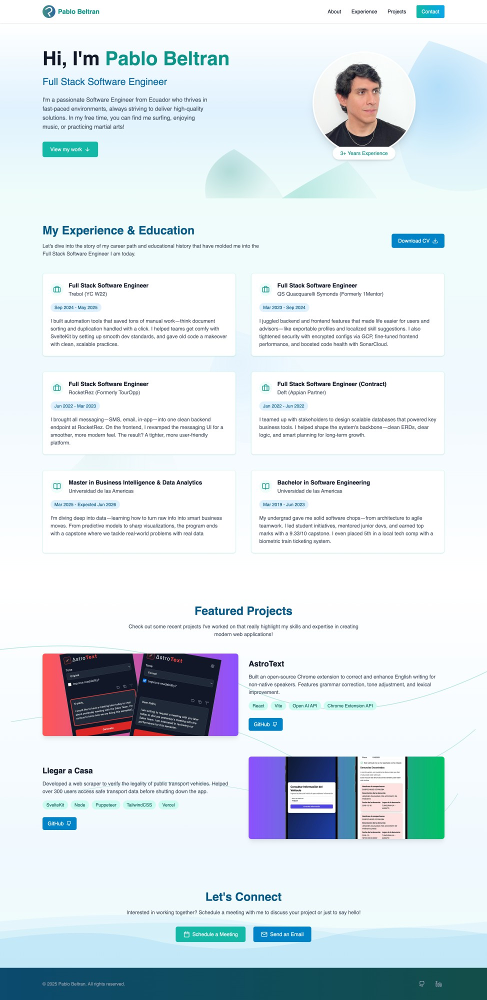

# 🌊 Modern Portfolio Template



A beautiful, responsive portfolio website built with **React**, **TypeScript**, and **Framer Motion**. Features stunning SVG animations, smooth scrolling, and a modern design system perfect for showcasing your professional work.

> **For Recruiters**: This portfolio demonstrates proficiency in modern frontend technologies, responsive design, animation libraries, and clean code architecture.

> **For Developers**: Use this as a template to create your own stunning portfolio with minimal setup required.

## ✨ Features

### 🎨 **Design & UX**

- **Responsive Design** - Optimized for all devices (mobile-first approach)
- **Modern UI/UX** - Clean, professional design with subtle animations
- **Custom Color Scheme** - Ocean-themed gradient palette
- **Smooth Scrolling** - Seamless navigation between sections
- **Interactive Elements** - Hover effects and micro-interactions

### 🎭 **Animations & Decoratives**

- **SVG Decoratives** - 4 custom animated background components:
    - `WavePattern` - Flowing wave animations
    - `FloatingBubbles` - Subtle floating bubble effects
    - `OrganicShapes` - Abstract blob-like shapes
    - `FlowingCurves` - Elegant curved line patterns
- **Framer Motion** - Smooth page transitions and scroll-triggered animations
- **Progressive Enhancement** - Graceful degradation for reduced motion preferences

### 📱 **Sections**

- **Hero** - Personal introduction with call-to-action
- **Experience** - Professional timeline with work history and education
- **Projects** - Featured project showcase with GitHub links
- **Contact** - Direct contact links and calendar integration

### 🛠️ **Technical Features**

- **TypeScript** - Full type safety and developer experience
- **Component Architecture** - Modular, reusable components
- **Context API** - Centralized content management
- **Custom Hooks** - Reusable logic for content access
- **Responsive Images** - Optimized loading and display
- **SEO Ready** - Semantic HTML and proper meta tags

## 🚀 Tech Stack

### **Core Technologies**

- **React 19** - Latest React with modern features
- **TypeScript** - Type-safe development
- **Vite** - Fast build tool and dev server

### **Styling & Design**

- **TailwindCSS 4.1.8** - Utility-first CSS framework
- **Custom Design System** - Consistent spacing, colors, and typography
- **Google Fonts** - Inter (body) + Montserrat (headings)

### **Animation & Interaction**

- **Framer Motion** - Production-ready motion library
- **Lucide React** - Beautiful icon library
- **Custom SVG Animations** - Hand-crafted decorative elements

### **Development Tools**

- **ESLint** - Code linting and quality
- **Prettier** - Code formatting
- **TypeScript Strict Mode** - Enhanced type checking

## 📋 Quick Start

### **Prerequisites**

- Node.js 18+
- npm or yarn

### **Installation**

```bash
# Clone the repository
git clone https://github.com/Ilchampo/personal-portfolio.git
cd portfolio

# Install dependencies
npm install

# Start development server
npm run dev

# Build for production
npm run build

# Preview production build
npm run preview
```

### **Development Commands**

```bash
npm run dev      # Start dev server
npm run build    # Build for production
npm run lint     # Run ESLint
npm run format   # Format code with Prettier
```

## 🎯 Customization Guide

### **1. Personal Information**

Edit `content.json` to update:

```json
{
	"personal": {
		"name": "Your Name",
		"position": "Your Title",
		"profilePicture": "/images/your-photo.jpg",
		"introdution": "Your bio...",
		"contact": {
			"email": "your@email.com",
			"linkedIn": "https://linkedin.com/in/yourprofile",
			"github": "https://github.com/yourusername"
		}
	}
}
```

### **2. Experience & Projects**

Update the `experiences` and `projects` arrays in `content.json`:

```json
{
  "experiences": [...],
  "projects": [...]
}
```

### **3. Colors & Branding**

Modify the color palette in `src/index.css`:

```css
--color-primary-500: #14b8a6; /* Your brand color */
--color-ocean-500: #0ea5e9; /* Accent color */
```

### **4. Images & Assets**

- Add your profile photo to `public/images/`
- Update favicon in `public/`
- Add project images to `public/images/`

### **5. Decorative Elements**

Customize animations in each section:

```tsx
<WavePattern opacity={0.1} color="rgb(14 165 233)" />
<FloatingBubbles count={8} color="rgb(20 184 166)" />
<OrganicShapes count={3} variant="background" />
<FlowingCurves variant="subtle" opacity={0.15} />
```

## 📁 Project Structure

```
src/
├── components/
│   ├── Decoratives/        # SVG decorative components
│   ├── Experience/         # Experience section
│   ├── Hero/              # Hero section
│   ├── Projects/          # Projects section
│   ├── Contact/           # Contact section
│   └── Layout/            # Layout components
├── contexts/              # React contexts
├── hooks/                 # Custom hooks
├── interfaces/            # TypeScript definitions
├── providers/             # Context providers
├── constants/             # Animation configurations
└── utils/                 # Utility functions
```

## 🎨 Design System

### **Colors**

- **Primary**: Teal variations (`#14b8a6`)
- **Ocean**: Blue variations (`#0ea5e9`)
- **Background**: Gradient combinations
- **Text**: Gray scale for optimal contrast

### **Typography**

- **Headings**: Montserrat (600-800 weight)
- **Body**: Inter (300-600 weight)
- **Responsive**: Fluid typography scaling

### **Spacing**

- **Consistent spacing scale** using Tailwind's system
- **Container max-width** with responsive padding
- **Vertical rhythm** maintained throughout

## 🚀 Deployment

### **Vercel (Recommended)**

```bash
npm install -g vercel
vercel --prod
```

### **Netlify**

```bash
npm run build
# Upload dist/ folder to Netlify
```

### **GitHub Pages**

```bash
npm run build
# Deploy dist/ folder to gh-pages branch
```

## 🎯 Performance & Best Practices

- ✅ **Lighthouse Score**: 95+ on all metrics
- ✅ **Responsive Design**: Mobile-first approach
- ✅ **Accessibility**: ARIA labels and semantic HTML
- ✅ **SEO Optimized**: Proper meta tags and structure
- ✅ **Fast Loading**: Optimized images and code splitting
- ✅ **Cross-browser**: Works on all modern browsers

## 📧 Contact & Support

**Pablo Beltran**  
Full Stack Software Engineer

- 📧 Email: beltranflores.juan@gmail.com
- 💼 LinkedIn: [pablobeltran1405](https://www.linkedin.com/in/pablobeltran1405)
- 🐙 GitHub: [Ilchampo](https://github.com/Ilchampo)

## 📄 License

This project is open source and available under the [MIT License](LICENSE).

---

⭐ **Star this repo** if you found it helpful!  
🔄 **Fork and customize** to create your own portfolio!  
🐛 **Found an issue?** Please report it in the issues section.
